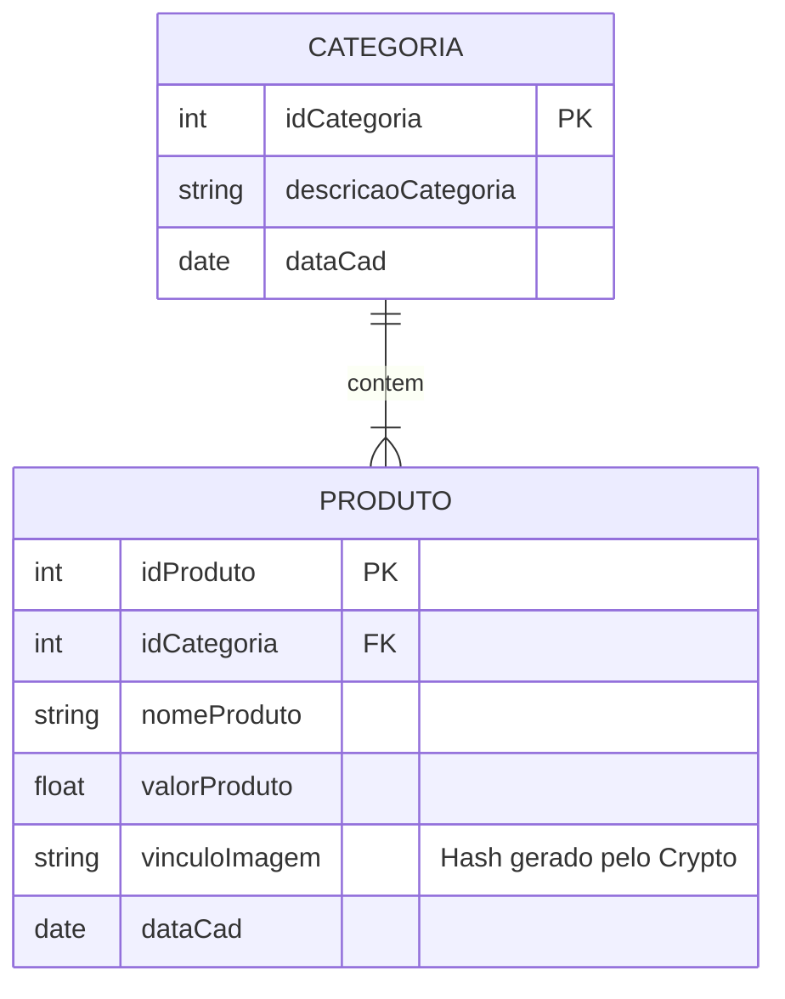

# 📦 API RESTful de Gerenciamento de Produtos (S1_R1)

> Backend robusto desenvolvido em Node.js para gerenciamento de inventário e categorização, com foco em consistência de dados e manipulação atômica de arquivos.

Este projeto implementa uma API RESTful seguindo a arquitetura **MVC (Model-View-Controller)**. O diferencial técnico reside na implementação de estratégias de **consistência eventual e atomicidade** manual no controlador de produtos, garantindo a integridade entre o armazenamento de arquivos (File System) e os registros no Banco de Dados (SQL).

---

## 🛠️ Stack Tecnológica

- **Runtime:** [Node.js](https://nodejs.org/)
- **Framework Web:** [Express.js](https://expressjs.com/)
- **Gerenciamento de Arquivos:** [Multer](https://github.com/expressjs/multer) (Multipart/form-data)
- **Segurança/Utils:**
- `crypto`: Hashing de nomes de arquivos para evitar colisão.
- `fs` & `path`: Manipulação nativa do sistema de arquivos.
- `Dotenv`: Gerenciamento de variáveis de ambiente.
- **Linguagem:** JavaScript (ES6+)
- **ORM/Query Builder:** Nenhum (SQL puro via Model) (Avaliando a utilização do Prisma futuramente)
- **Banco de Dados:** SQL (MySQL/MariaDB compatível via driver agnóstico no Model).

---

## 🏗️ Arquitetura e Padrões de Projeto

O projeto segue estritamente o padrão **MVC**, desacoplando a lógica de negócios, a interface de dados e o controle de fluxo.

### Fluxo de Dados (Data Flow)

1. **Routes:** Recebem a requisição HTTP e a direcionam para o controller ou middleware específico.

> Cetralizador de rotas para manter o código organizado e facilitar a injeção de dependências.

2. **Middleware (Upload):** Intercepta requisições `multipart/form-data`. Valida MIME types e tamanho (10MB). Se válido, persiste o arquivo em disco (`/uploads/images`).

> Regras de negócio e validações adicionais são tratadas no controller para manter o middleware focado apenas na manipulação de arquivos.

3. **Controller:**

- Orquestra a regra de negócio.
- Implementa lógica **ACID simulada**: Se a inserção no banco falhar, o arquivo recém-criado é removido fisicamente (`fs.unlinkSync`) para evitar órfãos.

> ACID usado para garantir que ambas as operações (inserção no DB e salvamento do arquivo) sejam atômicas, mesmo sem suporte nativo do banco para transações envolvendo o sistema de arquivos.

4. **Model:** Executa as queries SQL puras, isolando a camada de persistência.

### Estrutura de Diretórios

```text
├── src/
│   ├── config/           # Configuração de persistência e Multer (Storage Engine)
│   ├── controllers/      # Regras de negócio e tratamento de requisições/respostas
│   ├── middleware/       # Interceptadores (Validação de upload de imagem)
│   ├── model/            # DAO (Data Access Object) e Queries SQL
│   ├── routes/           # Definição de endpoints e injeção de dependências
│   └── server.js         # Entry point e configuração do Express
├── uploads/images/       # Armazenamento local (Static Assets)
├── docs/                 # Documentação SQL e notas de desenvolvimento
└── package.json

```

## 💾 Modelagem de Dados (Schema)

A integridade referencial é mantida através de chaves estrangeiras entre Produtos e Categorias.

### Diagrama ER Simplificado



## 🚀 Instalação e Configuração

### Pré-requisitos

- Node.js v14+
- Banco de Dados SQL configurado (Execute o script em `docs/db.sql`)

## 🔌 Documentação da API

### Endpoints de Produtos

#### `POST /produtos`

Cria um novo produto com upload de imagem. Implementa validação estrita e rollback de arquivo em caso de erro.

- **Content-Type:** `multipart/form-data`
- **Body (Form-Data):**
- `nomeProduto` (String): Nome do item.
- `valorProduto` (Float): Preço.
- `idCategoria` (Int): ID da categoria existente.
- `vinculoImagem` (File): Arquivo de imagem (JPG, PNG, JPEG). Max 10MB.

**Tratamento de Erros:**

- Se o arquivo não for suportado -> Retorna 400.
- Se o DB falhar -> O arquivo é deletado do disco e retorna 500.

#### `PUT /produtos/:idProduto`

Atualiza dados do produto.

- **Lógica de Atualização de Imagem:** Se uma nova imagem for enviada, o sistema automaticamente deleta a imagem antiga do diretório `/uploads` para economizar espaço e manter a consistência.

#### `DELETE /produtos/:idProduto`

Remove o registro do banco e o arquivo físico associado.

- Só remove a imagem se o `DELETE` no banco for confirmado com sucesso.

### Endpoints de Categorias

- `GET /categorias`: Lista todas as categorias.
- `POST /categorias`: Cria uma nova categoria (`application/json`).

## ⚙️ Detalhes de Implementação: Upload e Consistência

### Configuração do Multer (`produto.multer.js`)

O sistema utiliza uma engine de armazenamento em disco personalizada:

- **Hashing:** Utiliza `crypto.randomBytes(12)` para gerar nomes hexadecimais únicos, prevenindo sobreposição de arquivos com mesmo nome.
- **Sanitização:** Verifica a existência do diretório e o cria recursivamente se necessário.

### Estratégia de "Rollback" de Arquivos

No `produto.controller.js`, a consistência é tratada manualmente:

```javascript
try {
  await produtoModel.createProduto(produto);
  // Sucesso: Responde ao cliente
} catch (dbError) {
  // Falha: Executa limpeza do arquivo órfão
  const imagePath = path.resolve("uploads/images", req.file.filename);
  if (fs.existsSync(imagePath)) {
    fs.unlinkSync(imagePath);
  }
  // Retorna erro 500
}
```

###### made with ❤️ by rafael
