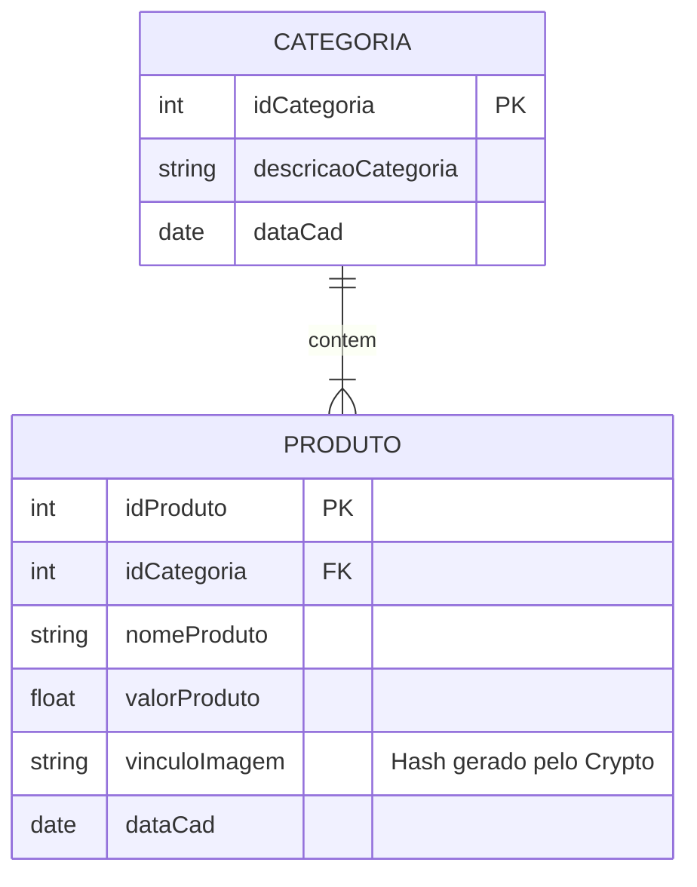

### Criar um sistema backend com Node.js que permita:

- Cadastrar, editar, selecionar e excluir produtos, que devem estar vinculados às suas respectivas categorias, considerando que uma mesma categoria pode estar associada a vários produtos.

- O sistema deve permitir o vínculo de uma imagem para cada produto cadastrado, sendo que o nome da imagem deverá ser armazenado no registro correspondente na tabela do banco de dados.

Propriedades desejadas:

> Produtos: idProduto, idCategoria, nomeProduto, valorProduto, vínculoImagem, dataCad
> Categoria: idCategoria, descricaoCategoria, dataCad



### Regras e Restrições:

- O upload da imagem deve ser feito utilizando multipart/form-data no insomia
- O sistema deve validar o tipo de arquivo da imagem (permitindo apenas JPG, PNG e JPEG) e limitar o tamanho máximo do arquivo a 10MB.
- Validações devem ser implementadas para garantir que os campos obrigatórios não sejam nulos ou vazios durante o cadastro e edição de produtos.
- Retornar mensagens de erro amigáveis para o usuário em caso de falhas, como tentativa de upload de arquivo inválido ou falha na conexão com o banco de dados.

---

### Debitos técnicos a serem implementados:

- Implementar paginação na listagem de produtos para melhorar a performance em casos de grandes volumes de dados.
- Implementar testes unitários e de integração para garantir a estabilidade das operações de CRUD e upload
  de imagens.
- Avaliar a utilização de um ORM/Query Builder como Prisma para facilitar a manipulação do banco de dados e melhorar a manutenção do código.
- Implementar o gerenciamento de variáveis de ambiente utilizando Dotenv para melhorar a segurança e flexibilidade da configuração do sistema. (Feito)
- Implementar a lógica de exclusão da imagem antiga ao atualizar um produto com uma nova imagem para evitar acúmulo de arquivos antigos no diretório de uploads. (Feito)
- Garantir que o processo de inserção do produto no banco e o salvamento da imagem no diretório sejam atômicos, utilizando transações ou outras estratégias para garantir que ambos aconteçam ou nenhum aconteça. (Feito)
- Garantir que ao deletar um produto do banco, a imagem associada seja deletada do diretório de uploads para evitar acúmulo de arquivos órfãos. (Feito)
- Implementar validação de campos obrigatórios no cadastro de produto para não subir null, e retornar mensagem de erro amigável para o usuário. (Feito)
- Tratar erros de upload de imagem (ex: tipo de arquivo não permitido, tamanho excedido e etc..., com aviso amigavel para o usuario). (Feito)
- Implementar o INSERT do produto e editar imagem no diretório de forma atômica "ACID" (ex: usando transações ou garantindo que ambos aconteçam ou nenhum aconteça). (Feito)

```JavaScript
  // teste do deleteProduto
  /**
   *
   * @param {*} req Express request object contendo o ID do produto a ser deletado nos parâmetros da URL
   *                e o nome do arquivo de imagem associado ao produto no banco de dados para garantir que a imagem correta seja deletada do diretório.
   * @param {*} res Express response object usado para enviar a resposta de sucesso ou erro para o cliente após a tentativa de deleção do produto e da imagem.
   *
   * Deleta um produto do banco de dados e também remove a imagem associada do diretório
   * Garante que a imagem seja deletada apenas se o produto for encontrado e deletado com sucesso no banco para evitar inconsistências
   */
  async deleteProduto(req, res) {
    const { idProduto } = req.params;
    const { vinculoImagem } = req.body; // Nome do arquivo de imagem associado ao produto
    try {
      const deleteResult = await produtoModel.deleteProduto(idProduto);
      if (deleteResult.affectedRows === 0) {
        return res.status(404).json({ message: "Produto não encontrado." });
      }

      // Deleta a imagem do diretório apenas se o produto foi deletado com sucesso no banco
      const imagePath = path.resolve("uploads/images", vinculoImagem);
      if (fs.existsSync(imagePath)) {
        fs.unlinkSync(imagePath);
      }

      return res.status(200).json({ message: "Produto e imagem deletados com sucesso." });
    } catch (error) {
      console.error("Erro ao deletar produto:", error);
      return res.status(500).json({ message: "Erro interno do servidor." });
    }

  },
```

---

###### made with ❤️ by rafão
